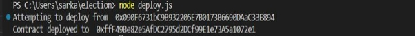

1. **Installing Node.js, npm and Git**

Starting in this section, we will begin to build and run projects in a local development environment. Please make sure you have installed the LTS (Long Term Support) version of Node.js:

<https://nodejs.org/en/download/>

We do not recommend installing the Current release as this often will include bugs or breaking changes that many libraries may not have fully resolved.

When you install Node.js it will automatically install **npm** which is a CLI tool that we will use frequently throughout the course.

**Installing Git**

You will also need to have Git installed on your system.

**Windows Users:**

Install Git For Windows using the link below. This will also install the GitBash terminal which is helpful as it will allow you to type the same commands as shown in the lecture videos. GitBash would replace the use of the CommandPrompt or Powershell.

<https://git-scm.com/download/win>

**Environment Setup**

Due to expected dependency conflicts with old installed versions, it would be best to create a brand-new project.

In your terminal of choice, run the following:

1. mkdir Election
1. cd Election
1. npm init -y
1. npm install solc@0.8.9 web3 mocha ganache @truffle/hdwallet-provider

1. **Updated Metamask Setup for new UI**

This note will provide instructions for setting up Metamask with its new UI.

1. First, install the extension for your specific browser (Chrome or Firefox recommended)
1. After the extension has been installed, click **Get Started**

   

1. Choose the **Yes, let's get set up!** option and click **Create a Wallet**

   

1. Agree to the terms and then enter a password. When finished, click **Create**

   

1. Click the box with a padlock to reveal your secret phrase. Copy the secret words somewhere safe, you will need to select them in the correct order on the next screen.

   

1. Select each word of your secret phrase in the correct order and click **Confirm**.

   

1. You should get a **Congratulations** message. If so, click **All done**

   

1. Exit out of any advertisements and you should now be at the Metamask dashboard.

   

1. Click **Ethereum Mainnet** and select **Show/Hide** **test networks**

   

1. Toggle the **Show test networks** button to **ON**

   

1. You can now change between networks similarly as shown in the lecture videos.

1. **Obtaining More Test Ether from Recommended Faucet**

Since we will be using the Sepolia Network, we will need to use a Sepolia faucet to obtain test ether. All current faucets require some level of authentication to protect against DOS attacks and bots.

**Option #1 Alchemy Sepolia Faucet**

**To avoid complications in onboarding, we generally recommend the following best practices:**

\- Use your actual first name and last name.

\- Avoid spammy domains in your email address. We recommend using @gmail.com, @outlook.com, @imessage.com, etc. — even your own domain if it’s legitimate.

\- If account creation using an email and password doesn’t work, try using “Sign in with Google” and connecting to your Google account.

\- Try another email address if your original one isn’t working.

\- Try from a new browser and new network.

1. Visit <https://sepoliafaucet.com/>
1. Register for a free Alchemy account (we recommend using “Sign in with Google” to avoid issues)
1. You should automatically be taken into an onboarding flow. If not you can find the Complete Onboarding button at the top right-hand of your screen:

   

1. You will be prompted to create a team. You may enter any value you wish.
1. The next prompt will be the type of project you are building. We are just requesting ether, so, you can put anything you'd like here.
1. At the Let's choose your chain prompt, select **Ethereum** and click **Next**.
1. Select the **Free** plan
1. At the credit card payment form, click **Skip for now**.
1. Enter anything into the How did you hear about us prompt and click **Let's Build**.
1. You will be redirected back to the Sepolia faucet landing page.
1. Go to the Metamask extension in your browser and make sure you are signed in and the **Sepolia Test Network** is selected. Then, copy the account address that is listed:

   

1. Paste your account address into the form on the Sepolia faucet landing page and click **Send me ETH**:

   

1. You will be redirected to a random screen with a link to click if you wish to view the transaction on the Sepolia testnet explorer.
1. You may exit this now. After a few seconds or minutes, you should see your Metamask balance increase:

   

1. **Infura Signup**

In this project, we are going to signup for an Infura account so that we can create an API key. Remember, Infura is just going to give us access to an outside test network to use.

1. **Register for a free Infura Account**
   Visit [**https://infura.io/register**](https://infura.io/register) and enter an email and password. Then, click the **CREATE A FREE ACCOUNT** button. Scroll through to the bottom of the ConsenSys terms and accept. After accepting the terms click the **CREATE A FREE ACCOUNT** button again.

   

1. **Verify your email**
   After registering for an account you will be prompted to verify your email. Navigate to your email provider and find the verification email Infura sent and click the **CONFIRM** button. You will then be redirected back to Infura.
1. **Accept More Terms**
   You will be presented with more Terms of Use. Click the **ACCEPT** button and then **I'M ALL SET!** on the following screen. 
1. **Create a New Key**
   You should currently be at <https://infura.io/dashboard>. Click the **CREATE NEW KEY** button. 

   
   In the popup modal, select the **Web3 API (Formerly Ethereum)** network. In the **NAME** field, you may provide any arbitrary value:
   

1. **Copy the Sepolia URL**
   Find **Ethereum** in the **NETWORK ENDPOINTS** section. Click the dropdown to select **SEPOLIA**. Copy the entire URL to your clipboard for use in the project.

**For Compiling, run following command on your terminal:**

node compile.js

**For Deployment, run following command on your terminal:**

node deploy.js

**After successful Deployment to the Sepolia Network, you should get the following message on your terminal:**

You may copy the address of your deployed contract and check on <https://sepolia.etherscan.io/>. Every time you perform a transaction involving this contract, it will be visible over there.
